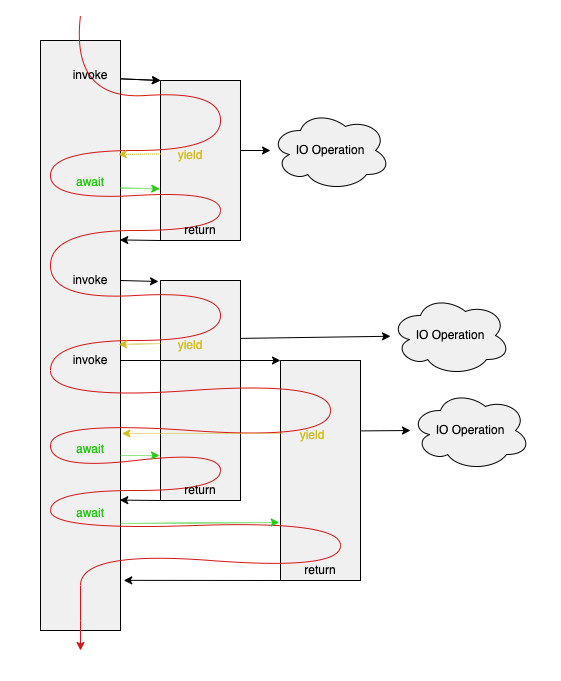
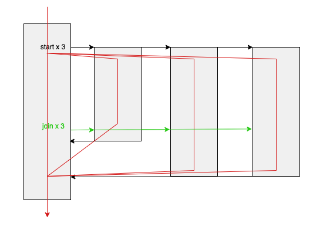

# Asynchronous and Multithreaded Programming

Asynchronous and multithreaded programming are to similar and intertwined concepts that are nonetheless subtly and importantly different. This tutorial will attempt to delve into the similarities, differeneces, applications, and C# specific implementation details.

# What is Asynchronous Programming

To perform a task asynchronously is to initiate a task, but then carry on with some other work whilst that task is pending. The case where this becomes particularly important is in the case of asynchronous IO (input/output). Any time a program needs to perform IO, be it reading a file from disk, sending some data over a network, or invoking another process, that task may involve an interminable delay (perhaps the disk is busy performing other reads, or the network interface is busy sending other packets). However, the application may need to continue handling user input, updating displayed graphics, or responding to network connections/messages.

Even in the absence of multithreading, asynchronous programming can be very useful, because even though only one piece of code can be running at a time, multiple tasks can be _queued_ for execution, and IO operations that incur some delay can cause a continuation task to be queued only once the IO operation is complete.

# What is Multithreaded Programming

Multithreaded programming is the execution of multiple segments of code at the same time, all using a shared memory space, with the transitions between them being managed non-deterministically by the operating system or programming runtime. That is to say that you can have two parts of your code both executing literally simultaneously (given multi-core hardware), and/or virtually simultaneously where one of the threads may be paused and another resumed at any point in your code. While asynchronous programming can ensure a program remains responsive or continue to make progress while it is waiting for long running IO operations, multithreaded programming enables a program to remain responsive even when performing some long running, computationally intesive process. Additionally, multithreaded code can make maximum use of the available hardrware on a multi-core system.

